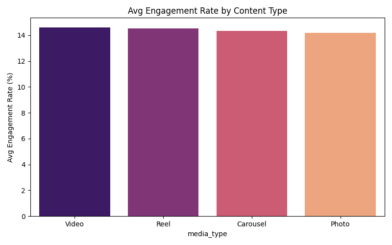
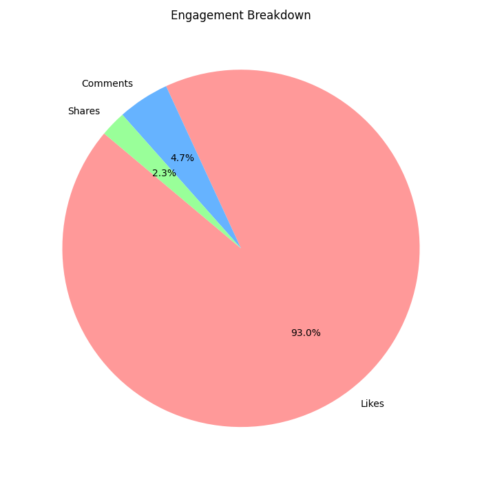

# Instagram-Engagement-Analysis
Social media data analysis using Python, Pandas, and Matplotlib.

# 📱 Instagram Engagement Analysis

## 🎯 Project Overview
This project analyzes a dataset of 30,000 Instagram posts to determine which factors drive the most engagement (Likes, Comments, and Shares). 

## 🛠️ Tech Stack
- **Language:** Python
- **Libraries:** Pandas (Data Manipulation), Matplotlib & Seaborn (Visualization)
- **Editor:** VS Code

## 📊 Key Findings
- **Top Content:** Reels generated the highest average engagement ($810M+$ total).
- **Peak Days:** Engagement peaks on **Wednesdays** and **Thursdays**.
- **Engagement Type:** 93% of interactions are **Likes**, followed by Shares and Comments.

## 📈 Visualizations

## 🚀 How to Run
1. Clone this repo.
2. Install dependencies: `pip install pandas matplotlib seaborn`
3. Run `python analysis.py`